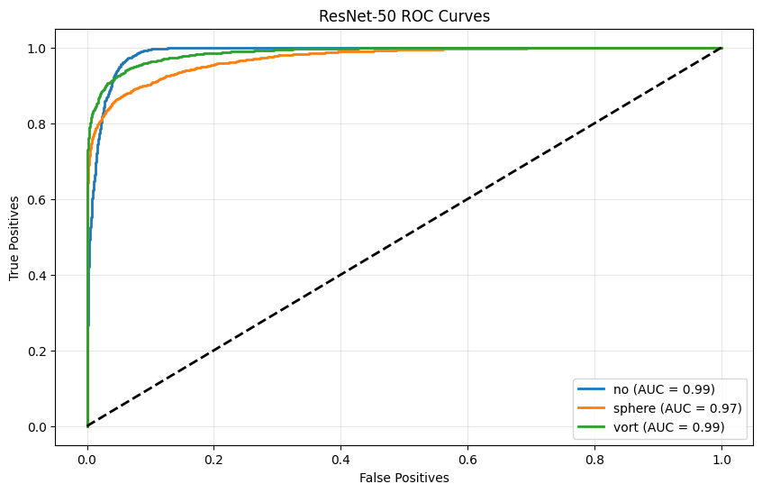
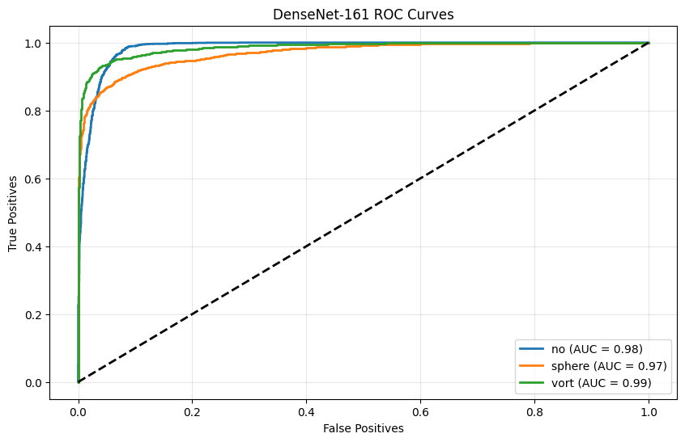
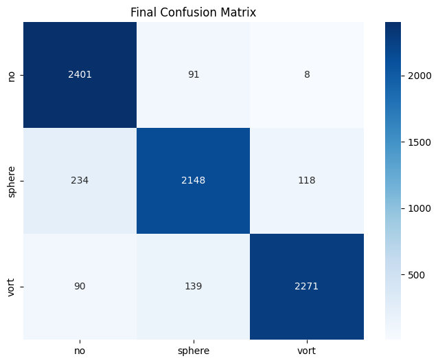
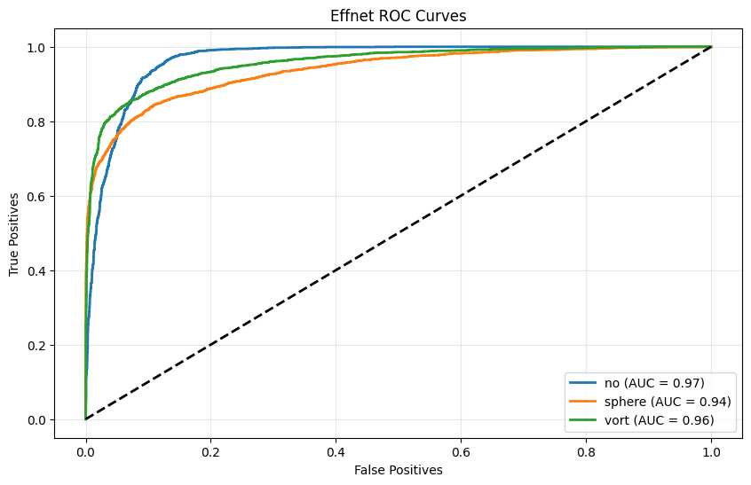
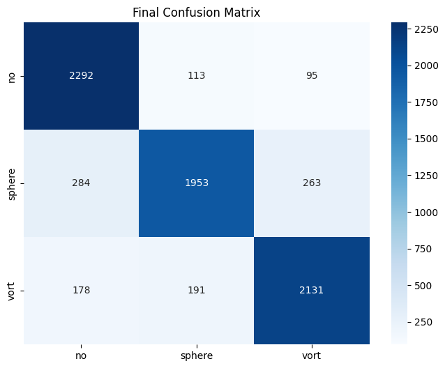

# Common Test I. Multi-Class Classification

Task: Build a model for classifying the images into lenses using PyTorch or Keras. Pick
the most appropriate approach and discuss your strateg

Dataset Description: The Dataset consists of three classes, strong lensing images with
no substructure, subhalo substructure, and vortex substructure. The images have been
normalized using min-max normalization, but you are free to use any normalization or
data augmentation methods to improve your results. There is an equal amount of data for each class. The Dataset is excluded from the repository.

Evaluation Metrics: ROC curve (Receiver Operating Characteristic curve) and AUC
score (Area Under the ROC Curve)

---

# Methodologies

In order to create a model with the highest performance, I decided to use transfer learning utilizing a pre-trained backbone. To achieve the task I compared 3 models with distinct architecture - Resnet50, DenseNet-161 & EfficientNetv2.

## Dimensionality Reduction
The features are getting compressed and filtered out using linear transformation and ReLU activation with all models final layer having 64 features. The proces in preceded by Global Average Pooling (GAP), collapsing the spatial dimensions and ensuring the model is invariant to the objects position in the image.

## Regularization
The models use BatchNorm to normalize inputs and Dropout to deactivate neurons during training, preventing overfitting.

## Loss Function
The loss function used is CrossEntropyLoss, which is the most preferable function for multi-class classification.

## Adaptive Learning
All models use the Adam optimizer to adjust the learning rate for each parameter.

---
# Hyperparameters

A large variety of hyperparameters was tested but for most of the final models I used these.

## Hyperparameters
BATCH_SIZE: 64
LEARNING_RATE: 1e-4 (1e-3 for resnet)
DROPOUT: 0.33 (0.3 for densenet)
EPOCHS: 10
OPTIMIZER: Adam
LOSS FUNCTION: CrossEntropyLoss

---
# Results

ResNet and DenseNet achieved very similar performance while EffNet had a slightly lower one. The AUC score in the table are OvA.

| Metric | ResNet | DenseNet | EffNet| 
| :--- | :--- | :--- |:---| 
| **AUC Score - No** | 0.99 | 0.98 | 0.97| 
| **AUC Score - Sphere** | 0.97 | 0.97 | 0.94| 
| **AUC Score - Vort** | 0.99 | 0.99 | 0.96| 
| **No substructure F1-Score** | 0.92 | 0.92 | 0.87| 
| **Vortex substructure F1-Score** | 0.88 | 0.88 | 0.82| 
| **Subhalo substructure F1-Score** | 0.92 | 0.93 | 0.85| 
| **Accuracy** | 0.91 | 0.91 | 0.85| 

---
# Visualizations

## Resnet 50

## Densenet 161

## EfficientNetv2

