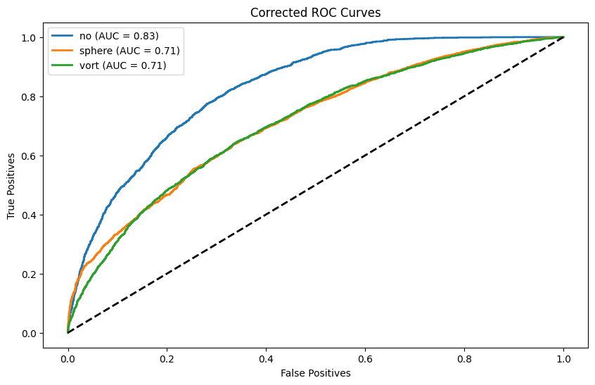
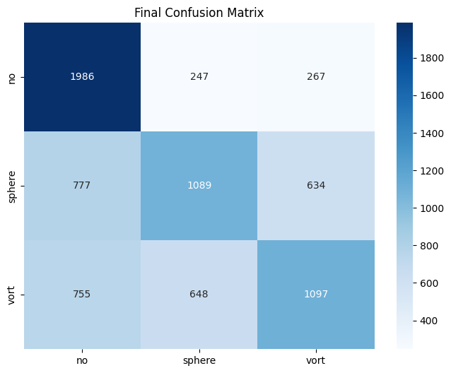

# Specific Test III. Quantum ML
Task: Build a quantum machine learning model for classifying the images into lenses
using a quantum computing framework such as Qiskit, PennyLane, or Cirq.
Downsample and downscale the dataset to a size suitable for quantum circuits (e.g.,
reduce image resolution and/or apply dimensionality reduction techniques such as
PCA). Design and train a parameterized quantum circuit (variational quantum classifier)
for the multi-class classification task. Pick the most appropriate approach and discuss
your strategy, including your choices for data encoding, circuit architecture, and
classical-quantum hybrid training.

Dataset Description: The Dataset consists of three classes, strong lensing images with
no substructure, subhalo substructure, and vortex substructure. The images have been
normalized using min-max normalization, but you are free to use any normalization or
data augmentation methods to improve your results.

Evaluation Metrics: ROC curve (Receiver Operating Characteristic curve) and AUC
score (Area Under the ROC Curve)

---

# Methodologies

In order to create a model with the highest performance, I decided to use transfer learning utilizing a pre-trained backbone. To achieve the task I used a model which achieved the highest performance using classic ml methods - ResNet 50. 

## Feature Extraction
The features are extracted before running the model into files for train and validation sets. It accelerates the quantum training later on and allows for more flexibility when choosing the hyperparameters and the architercutre.

## Dimensionality Reduction
The features are getting compressed and filtered out using linear transformation and ReLU activation with the model having 64 features and finally 12 to match the amount of qubits. 

## Regularization
The model uses BatchNorm to normalize inputs and Dropout to deactivate neurons during training, preventing overfitting.

## Loss Function
The loss function used is CrossEntropyLoss, which is the most preferable function for multi-class classification.

## Adaptive Learning
The quantum model uses the Adam optimizer to adjust the learning rate for each parameter. It also uses ReduceLROnPlateau to decrease the learning rate if there is no improvement in 3 epochs.

## Data Encoding
The AngleEmbedding function scaled the features [-pi/2, pi/2] (ensures data right place on Bloch Sphere) to avoid the data representation problems in the quantum state. 

## Entangling 
The qubits get the 3 axis rotation and then each qubits is getting linked to another using a CNOT gate.

## Connecting classic ml and quantum
To bridge the differences between classic ml and quantum ml, the expectation values turn quant probabilities into numbers and the parameter-shift rule ensures smooth transition from qubits to neurons.

---
# Hyperparameters

A large variety of hyperparameters was tested but for most of the final models I used these.

## Hyperparameters
BATCH_SIZE: 32
LEARNING_RATE: 1e-3
DROPOUT: 0.33
EPOCHS: 20
QUBITS: 12
LAYERS: 7
OPTIMIZER: Adam
LOSS FUNCTION: CrossEntropyLoss

---
# Results

The Quantum model achieved a much lower performance which was to be expected considering the quantum limitations. With time and system constraints - the following is the best model.

| Metric | Quantum |
| :--- | :--- |
| **AUC Score - No** | 0.83 |
| **AUC Score - Sphere** | 0.71 |
| **AUC Score - Vort** | 0.71 |
| **No substructure F1-Score** | 0.66 |
| **Vortex substructure F1-Score** | 0.49 |
| **Subhalo substructure F1-Score** | 0.49 |
| **Accuracy** | 0.56 |

---
# Visualizations

